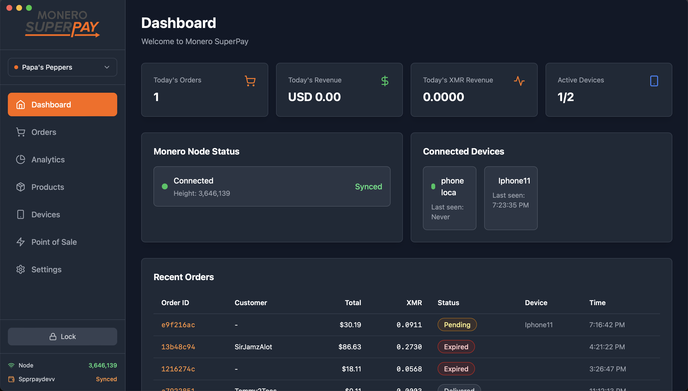
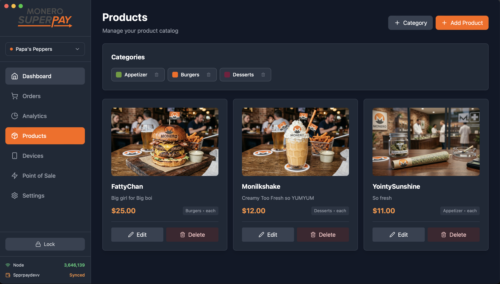
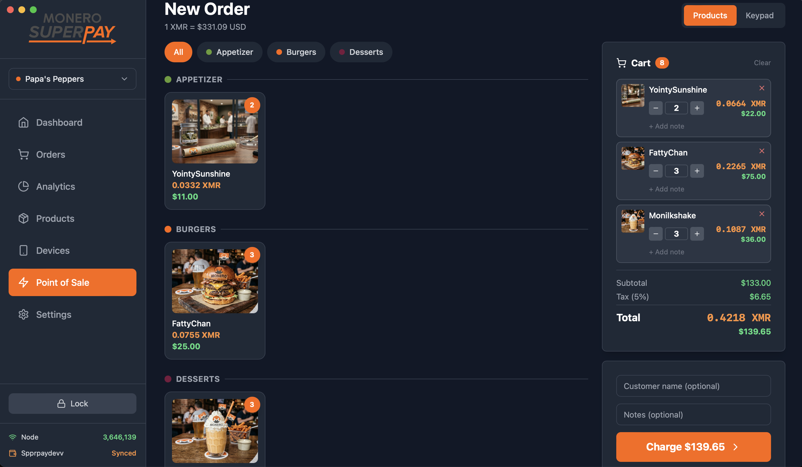
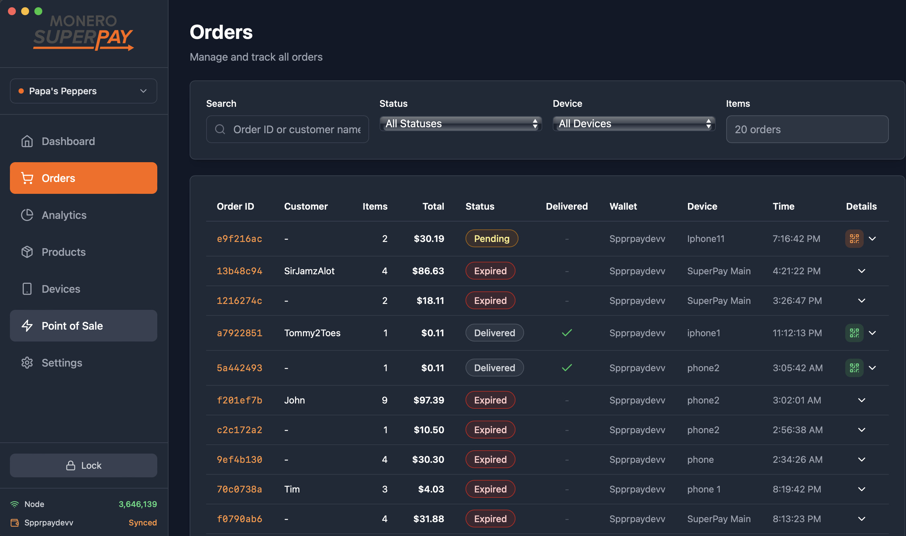
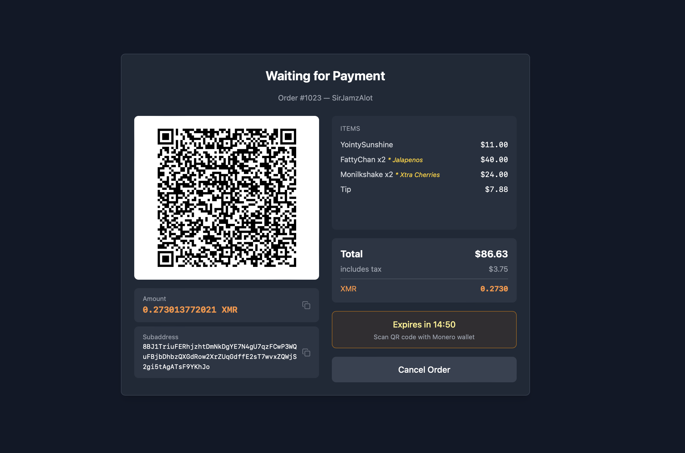
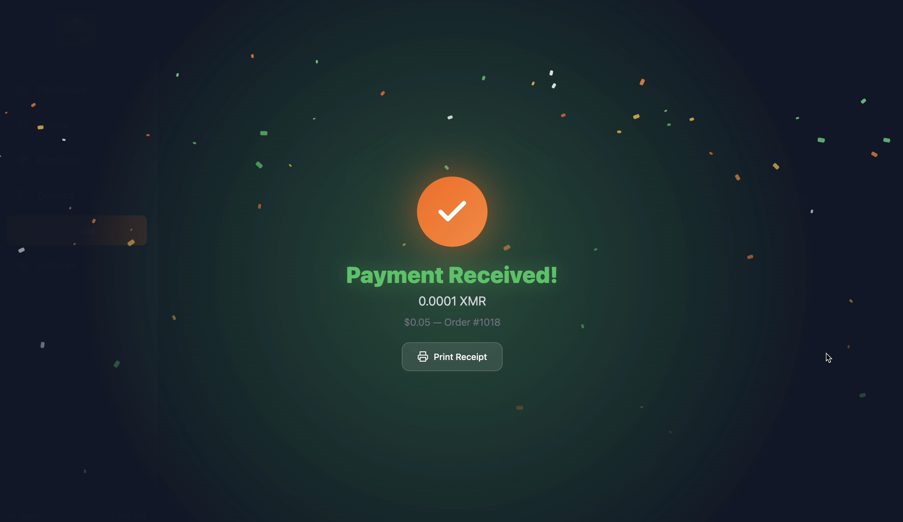
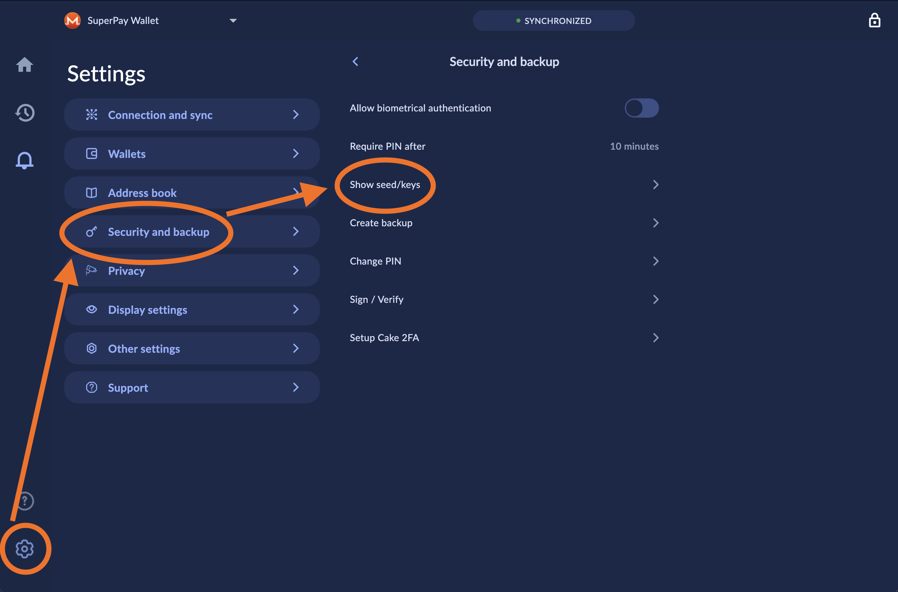
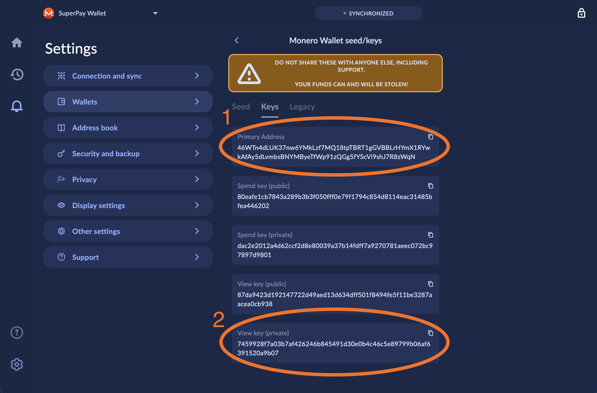
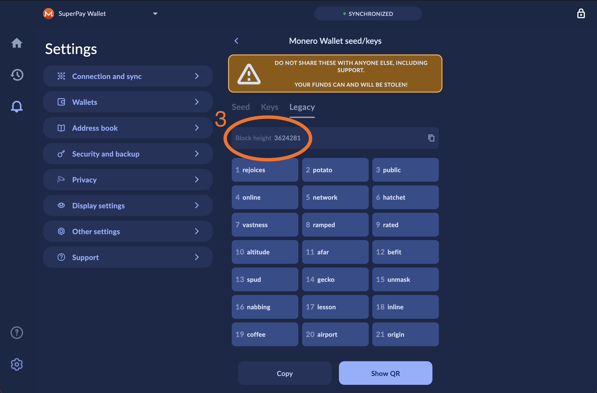

# Monero SuperPay

A self-hosted, trustless point-of-sale system for accepting Monero (XMR) payments. Your keys never leave your device.



## Download

| Platform | Download |
|----------|----------|
| **macOS** | [MoneroSuperPay.dmg](https://github.com/brainchainz/Monero-SuperPay/releases/latest/download/MoneroSuperPay-1.0.0.dmg) |
| **Umbrel** | Add the community app store (see below) |

## Features

- **Multi-Device PoS** — Connect tablets, phones, or computers as registers via QR code pairing
- **Product Catalog** — Manage products with images, prices, categories, and descriptions
- **Shopping Cart** — Full cart with order management and history tracking
- **Real-Time Payments** — WebSocket-based notifications for instant payment confirmation
- **Sales Analytics** — Revenue tracking, order history, and sales reports
- **View-Only Wallet** — Your private spend keys never touch the server
- **Multi-Currency** — Display prices in XMR or fiat equivalents (USD, EUR, etc.)
- **Three PoS Modes** — Keypad (quick amount), product grid, or full cart checkout

## Screenshots

| Dashboard | Products | Point of Sale / Cart |
|-----------|----------|----------------------|
|  |  |  |

| Orders | Payment Screen | Payment Received |
|--------|----------------|------------------|
|  |  |  |

---

## Finding Your Monero View-Only Wallet Info

Monero SuperPay uses a **view-only wallet** so your spend keys never leave your personal wallet. You need three things from your wallet:

1. **Primary Address** (starts with `4`)
2. **Private View Key** (64-character hex string)
3. **Restore Height** (block number when your wallet was created)

Here's how to find them in **Cake Wallet**:

### Step 1: Open Security & Backup

In Cake Wallet, go to **Settings** → **Security and backup** → **Show seed/keys**.



### Step 2: Copy Your Address and View Key

On the seed/keys screen, find and copy your **Primary Address** and **Private View Key** (labeled "View key (private)"). Tap the copy button next to each one.



### Step 3: Note Your Block Height

Scroll down (or switch to the **Keys** tab) to find the **Block height**. This tells SuperPay where to start scanning the blockchain — without it, sync takes much longer.



> **Other Wallets:** Most Monero wallets have a similar "Show keys" or "Wallet info" section. Look for the view key and restore height in your wallet's settings or security menu. The Monero GUI wallet shows this under Settings → Seeds & Keys.

---

## Install — Umbrel

1. Open your Umbrel dashboard
2. Go to **App Store** → **Community App Stores**
3. Add this URL: `https://github.com/brainchainz/Monero-Superbrain`
4. Find **Monero SuperPay** in the store and click **Install**
5. Open the app and enter your view-only wallet info

## Install — macOS Desktop

1. Download [MoneroSuperPay.dmg](https://github.com/brainchainz/Monero-SuperPay/releases/latest/download/MoneroSuperPay-1.0.0.dmg)
2. Open the DMG and drag MoneroSuperPay to Applications
3. Launch the app and set your PIN
4. Connect to your Monero node and enter your view-only wallet info
5. Start accepting payments

---

## Support the Project

If you find Monero SuperPay useful, consider supporting development:

**Kuno Fundraiser:** https://kuno.anne.media/fundraiser/ufmp/

**Donate XMR:**
```
489mHXbSehCF5oraCQvmRYSe9mkxyqZ6XJBS8A4af6qzbKBx3b26bLSRUVso9R6PTSgEX7RggVPc5hxcZnAaRKCT7iekvDX
```

## Support & Feedback

- [GitHub Issues](https://github.com/brainchainz/Monero-SuperPay/issues)
- [Discussions](https://github.com/brainchainz/Monero-SuperPay/discussions)

## License

MIT License — see LICENSE file for details.

---

**Built with privacy in mind. Self-hosted. Trustless. For Monero.**
